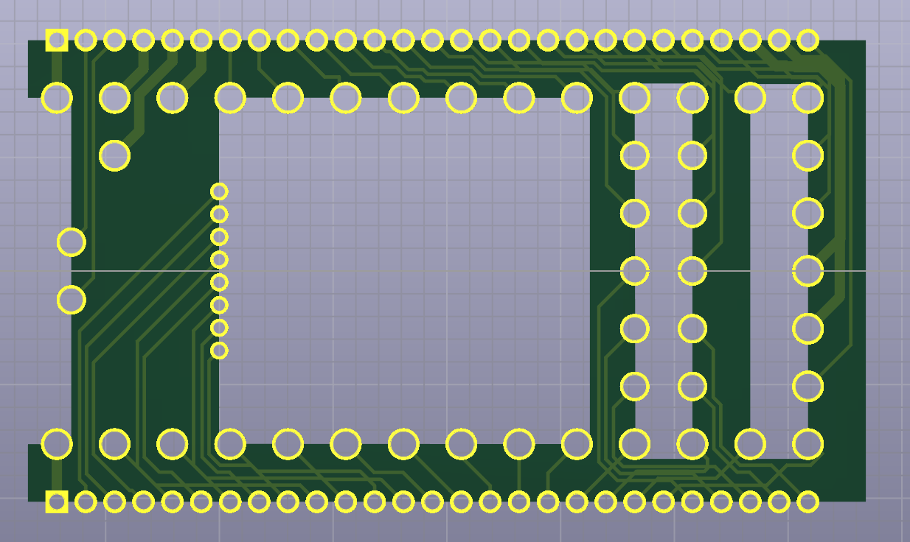

A breakout board for the PJRC.com Teensy 4.0 board that is soldered directly to the bottom of the Teensy board via castellated solder points.

Note:  I've decided to not use this.  Check out [this newer version](../teensy_header_breakout/) which uses more common 0.1" headers.

Designed in KiCad.

Expands to 2 rows of .05" headers or further castellated solder points.

One advantage of this is that if the breakout board top is soldered directly
to the bottom of the host board, the Teensy can be flush with the main board via a cutout.

